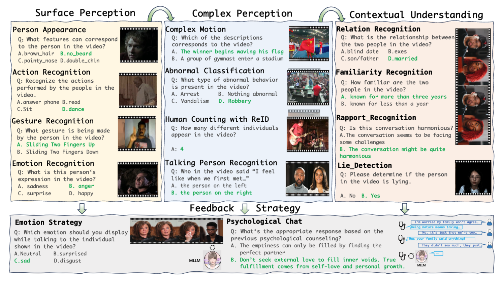
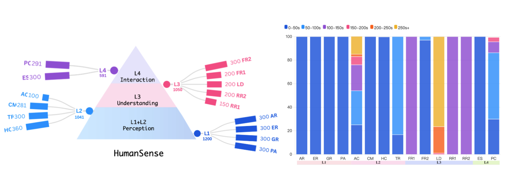
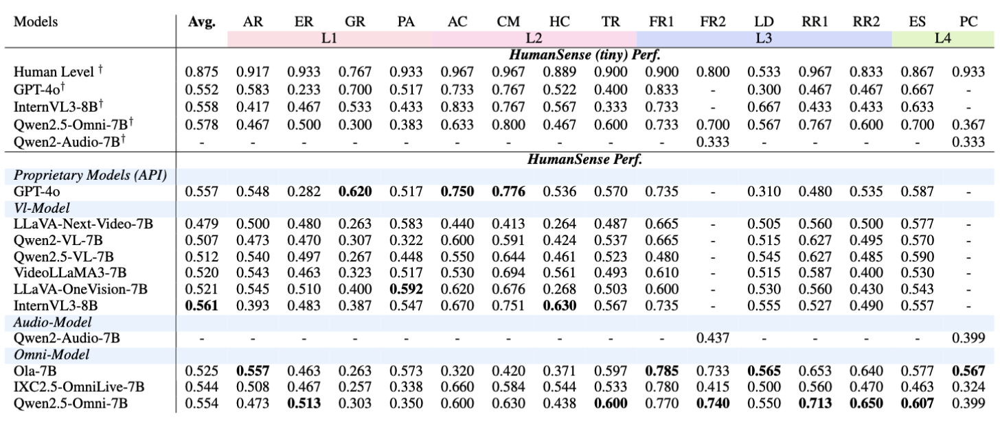

<div align="center" style="font-family: charter;">

<h1></br>HumanSense: From Multimodal Perception to Empathetic Context-Aware Responses through Reasoning MLLMs</h1>

<div>
    <a href="https://scholar.google.com/citations?user=sPQqpXsAAAAJ&hl=en&oi=sra">Zheng Qin<sup>1</sup></a>,
    <a href="https://scholar.google.com/citations?user=S8FmqTUAAAAJ&hl=en">Ruobing Zheng<sup>*</sup><sup>2</sup></a>,
    <a href="https://scholar.google.com/citations?user=3WVFdMUAAAAJ&hl=en">Yabing Wang<sup>1</sup></a>,
    <a href="https://scholar.google.com/citations?user=yOtsVWQAAAAJ&hl=en&oi=sra">Tianqi Li<sup>2</sup></a>,
    <a href="https://yuanyi.pub/">Yi Yuan<sup>2</sup></a>,
    <a href="https://scholar.google.com/citations?hl=en&user=8SCEv-YAAAAJ&view_op=list_works&sortby=pubdate">Jingdong Chen<sup>2</sup></a>,
    <a href="https://scholar.google.com/citations?user=RypRCUQAAAAJ&hl=en">Le Wang<sup>†<dag><sup>1</sup></a> <br>
    <span style="font-size: 13px; margin-top: 0.8em">
    <br>
    <sup>*</sup>Co-first authors. Project Lead.
    <sup>†</sup>Corresponding Author.
    <br>
    <sup>1</sup>Xi’an Jiaotong University. <sup>2</sup>Ant Group.
    <br>
    </span>
</div>


<a target="_blank" href="https://arxiv.org/abs/2508.10576" ><button><i class="ai ai-arxiv"></i> arXiv:2508.10576</button></a>
&nbsp;&nbsp;&nbsp;&nbsp;&nbsp;&nbsp;&nbsp;&nbsp;&nbsp;&nbsp;&nbsp;&nbsp;&nbsp;&nbsp;
<a target="_blank" href="https://digital-avatar.github.io/ai/HumanSense/" ><button><i class="ai ai-arxiv"></i> Homepage</button></a>
&nbsp;&nbsp;&nbsp;&nbsp;&nbsp;&nbsp;&nbsp;&nbsp;&nbsp;&nbsp;&nbsp;&nbsp;&nbsp;&nbsp;
<a target="_blank" href="https://huggingface.co/datasets/antgroup/HumanSense_Benchmark">
  <button>
    
    Hugging Face (data)
  </button>
</a>
&nbsp;&nbsp;&nbsp;&nbsp;&nbsp;&nbsp;&nbsp;&nbsp;&nbsp;&nbsp;&nbsp;&nbsp;&nbsp;&nbsp;
<a target="_blank" href="https://huggingface.co/antgroup/HumanSense_Omni_Reasoning">
  <button>
    
    Hugging Face (model)
  </button>
</a>


        

<p align="justify"><i>While Multimodal Large Language Models (MLLMs) show immense promise for achieving truly human-like interactions, progress is hindered by the lack of fine-grained evaluation frameworks for human-centered scenarios, encompassing both the understanding of complex human intentions and the provision of empathetic, context-aware responses. 
            Here we introduce HumanSense, a comprehensive benchmark designed to evaluate the human-centered perception and interaction capabilities of MLLMs, with a particular focus on deep understanding of extended multimodal contexts and the formulation of rational feedback. 
            Our evaluation reveals that leading MLLMs still have considerable room for improvement, particularly for advanced interaction-oriented tasks. Supplementing visual input with audio and text information yields substantial improvements, and Omni-modal models show advantages on these tasks.
            Furthermore, we argue that appropriate feedback stems from a contextual analysis of the interlocutor's needs and emotions, with reasoning ability serving as the key to unlocking it. Accordingly, we devise a multi-stage, modality-progressive reinforcement learning approach, resulting in HumanSense-Omni-Reasoning, which substantially enhances performance on higher-level understanding and interactive tasks. Additionally, we observe that successful reasoning processes exhibit highly consistent thought patterns. By designing corresponding prompts, we also enhance the performance of non-reasoning models in a training-free manner.     
            </i></p>

</div>

## Release
- `2025-08-27` :hearts: We release both the training code and dataset!
- `2025-08-27` :hearts: We released Benchmark and code!
- `2025-08-15` :rocket: We released our paper!

## Contents

- [Release](#release)
- [Contents](#contents)
- [HumanSense](#humansense)
- [Results](#results)
- [RUN Your Own Evaluation](#run-your-own-evaluation)
- [Training Omni Model](#training-omni-model)
- [Citation](#citation)


## HumanSense
The evaluation tasks are organized into a four-tier pyramid structure (L1–L4) according to increasing levels of difficulty:



## Results

**Evaluation Setups:** We conduct a comprehensive evaluation of leading Multimodal Large Language Models (MLLMs) with sizes up to 10B, including: (1) Visual LLMs, which represent the most mainstream branch of MLLMs today; (2) Audio LLMs; and (3) Omni-modal LLMs that are natively designed for integrating vision, audio, and text. 


## RUN Your Own Evaluation

### Requirements
- Configure the environment required for the model to be tested; the benchmark has no special requirements.

- ffmpeg
  ```bash
  conda activate Modelxx_env (the environment corresponding to the tested model.)
  cd HumanSense-main
  wget https://ffmpeg.org/releases/ffmpeg-4.4.tar.gz
  tar -xvf ffmpeg-4.4.tar.gz
  cd ffmpeg-4.4
  ./configure
  make
  sudo make install
   ```

### Installation
-  **Download Dataset**: Retrieve all necessary files from the folder bench_data in [🤗 HumanSense_Benchmark](https://huggingface.co/datasets/antgroup/HumanSense_Benchmark).
   
-  **Decompress Files**: Extract the downloaded files and organize them in the `./HumanSense_bench` directory as follows:

   ```
   HumanSense-main/
   ├── HumanSense_bench/src/data
   │   ├── audios/           
   │   ├── videos/             
   │   ├── HumanSense_AQA.json           
   │   └── HumanSense_VQA.json        
   ```

### Evaluation
- **Model Preparation**: Prepare your own model for evaluation by following the instructions provided [here](./docs/model_guide.md). This guide will help you set up and configure your model to ensure it is ready for testing against the dataset.
Now you can run the benchmark:

- **Run and score**:
  ```sh
  cd HumanSense-main
  sh HumanSense_bench/eval.sh
  sh HumanSense_bench/eval_audio.sh
  sh HumanSense_bench/score.sh
  ```


## Training Omni Model
We train [Qwen25-Omni-7B](https://huggingface.co/Qwen/Qwen2.5-Omni-7B) using 8 x H20 (96G) GPUs

### Requirements
```
# First, configure the environment required to run Qwen25-Omni-7B.
conda activate omni
pip install accelerate
# It's highly recommended to use `[decord]` feature for faster video loading.
pip install qwen-omni-utils[decord] -U


# configure the training requirements
cd HumanSense-main/Open-R1-Video
pip3 install -e ".[dev]"
pip uninstall transformers
unzip transformers-main.zip
cd transformers-main
pip install -e .
cd ..
pip install nvidia-cublas-cu12 -U
pip3 install flash_attn --no-build-isolation
pip uninstall qwen-omni-utils
cd qwen-omni-utils
pip install -e .
cd ..
pip uninstall qwen-vl-utils
cd qwen-vl-utils
pip install -e .
cd ..

pip install qwen-omni-utils[decord] -U
pip install trl==0.14.0
pip install tensorboardX 
```

### Datas Installation
-  **Download Dataset**: Retrieve all necessary files from the folder train_data in [🤗 HumanSense_Benchmark](https://huggingface.co/datasets/antgroup/HumanSense_Benchmark).
   
   
-  **Decompress Files**: Extract the downloaded files and organize them in the `./Open-R1-Video` directory as follows:

   ```
   HumanSense-main/
   ├── Open-R1-Video/data
   │   ├── audios/           
   │   ├── videos/             
   │   ├── merged_video_wo_audio.json
   │   ├── merged_video_audio.json           
   │   └── merged_video_w_audio.json 
   ```
### Training
- **Run**:
  ```sh
  cd HumanSense-main
  sh Open-R1-Video/framework1/qwen-7b_omni_1video_wo_audio.sh
  sh Open-R1-Video/qwen-7b_omni_2audio.sh
  sh Open-R1-Video/framework2/qwen-7b_omni_3video_w_audio.sh
  ```
At any stage of training, if the loaded weights do not contain spk_dict.pt, please copy Open-R1-Video/experiments/spk_dict.pt to it.

We release the trained model in [🤗 HumanSense_Omni_Reasoning](https://huggingface.co/antgroup/HumanSense_Omni_Reasoning)
- **Inference**: Modify the model name to "rivideo-omni7B", and subsequently update the loaded weights to the trained ones.
 ```sh
  cd HumanSense-main
  sh HumanSense_bench/eval.sh
  sh HumanSense_bench/eval_audio.sh
  sh HumanSense_bench/score.sh
  ```


## Citation

If you find our paper and code useful in your research, please consider giving us a star :star: and citing our work :pencil: :)
```
@article{qin2025humansense,
  title={HumanSense: From Multimodal Perception to Empathetic Context-Aware Responses through Reasoning MLLMs},
  author={Qin, Zheng and Zheng, Ruobing and Wang, Yabing and Li, Tianqi and Yuan, Yi and Chen, Jingdong and Wang, Le},
  journal={arXiv preprint arXiv:2508.10576},
  year={2025}
}
```
